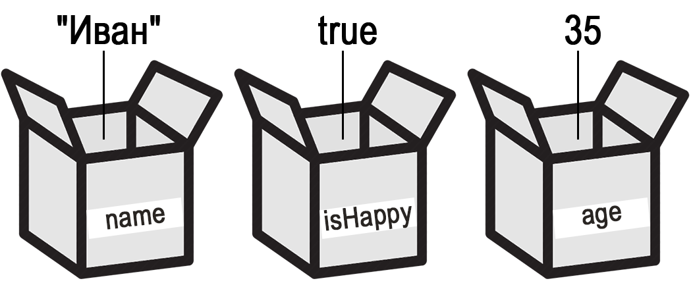

# Переменные

Очень часто в программах необходимо иметь возможность отслеживать какие-либо значения, поскольку в ходе выполнения программы, над ними совершаются различные операции и эти значения изменяются. Для отслеживания значений в программе для них выделяется определенное место в памяти, которое можно представить в виде контейнеров, этим контейнерам присваивается идентификатор, то есть имя, по которому впоследствии можно будет найти контейнер с нужным нам значением.


Переменные в программировании — это и есть те самые контейнеры, внутри которых вы можете хранить необходимые значения. Важно понимать, что переменные не являются самими значениями, они лишь предоставляют для них место.
Есть несколько ключевых слов, для объявления переменных : `var`, `let` и `const`.

У переменных, объявленных с `var`, `let` или `const`, есть своя специфика использования, о которой будет рассказываться далее в течение курса. А также у переменных, объявленных через `var`, есть некоторые неочевидные особенности, незнание которых, может негативно сказываться на разработке и поддержке кода. Поэтому с выходом стандарта ES6, где появились новые ключевые слова `let` и `const`. Объявление через `var` используется всё меньше и можно сказать устаревает. Но знать о особенностях и побочных эффектах `var` переменных очень важно.

Для объявления переменной используется ключевое слово и следом имя, которым вы захотите ее назвать:

```javascript
var myName;
let age;
```

Вы можете назвать переменную как угодно, но есть ограничения. Как правило, вы должны придерживаться только латинских символов (0-9, a-z, A-Z) и символа подчеркивания. Подробнее о правилах именования можно прочитать [здесь](https://learn.javascript.ru/variable-names).

После объявления переменной, вы можете присвоить ей значение:

```javascript
myName = "Иван";
age = 30;
```

Или же вы можете сделать обе эти операции на одной и той же строке:

```javascript
var myName = "Иван";
let age = 30;
```

Причем такое присваивание нужного значения сразу при объявлении переменной является обязательным при объявлении переменных через ключевое слово `const`.

```javascript
const height = 180;
```

Ключевое слово `const` создаёт константу - переменную, значение которой не может быть переопределено. Поэтому попытка объявить константу, не присвоив ей при этом значение (другими словами - без её инициализации), вызовет синтаксическую ошибку:

```javascript
const height;
> Uncaught SyntaxError: Missing initializer in const declaration
```

Имя переменной, это её _идентификатор_, по которому её можно найти. Вы можете получить значение, просто вызвав переменную по имени:

```javascript
myName;
age;
height;
```

Если вы запросите значение переменной, которую объявили, но не присвоили ей никакого значения, то в ответе вам придёт `undefined`:

```javascript
var x;
console.log(x);

> undefined
```

`undefined`, это особый тип данных в javascript, который выражает, что "значение не определено" ("не присвоено").

После установки значения переменной, объявленной через `var` и `let` вы можете изменить его позже:

```javascript
var myName = "Иван";
myName = "Ваня";

let age = 30;
age = 31;
```

Значение переменной, которую вы объявили через `const`, переопределить уже нельзя.

```javascript
const height = 180;
height = 200;

> Uncaught TypeError: Assignment to constant variable.
```

Так как это ключевое слово подразумевает объявление константы - переменной, значение которой постоянно, то такая попытка переопределить её значение вызовет ошибку `TypeError` в консоли. В следующих частях курса будет показано, что само значение константы в действительности может меняться и это зависит от типа данных, которые в ней хранятся.

JavaScript, это язык со слабой типизацией (другое название - динамическая типизация), поэтому переменные могут содержать абсолютно разные типы данных, например, строки, числа, объекты, функции и другие типы, которые будут рассматриваться в следующих частях курса. Здесь важно еще раз подчеркнуть, что переменная - это поименованная область памяти, и в ней могут храниться различные типы значений.



В отличие от некоторых других языков программирования со статической типизацией, например таких как C++, C#, Java, в JavaScript вам не требуется как-то явно указывать тип данных для переменных. Потому что переменная связывается с типом в момент присваивания значения, а не в момент объявления переменной.

```javascript
let age = 35;
age = "Тридцать пять";
```

Переменная age начинает свой жизненный цикл с хранения числа `35`, а затем хранит строку. А потом в какой-то момент ей можно присвоить значение с любым другим типом.

В любом случае переменная `age` хранит текущее значение, которое меняется по ходу выполнения программы, иллюстрируя первичную цель переменных: хранение текущего состояния программы, которое может изменяться по ходу её выполнения.

Если значения переменных `var` и `let` могут меняться в ходе выполнения программы, то переменные `const` предназначены для хранения постоянных значений. Часто бывает нужно задать определенные значения в программе, которые впоследствии никак не будут меняться в течение её работы, а только использоваться для получения самих данных. То есть другими словами необходимо задать константы и для этой цели тоже используются переменные.

До выхода стандарта ES6 в 2015 году для объявления констант использовалось всё то же ключевое слово `var`, только имя этой константы записывалось большими буквами, с подчеркиваниями `_` между словами, тем самым предупреждая других разработчиков или себя в будущем, что это константа и менять её дальше в коде нельзя, например:

```javascript
var PI = 3.14;
var radius = 10;
var circle = 2 * PI * radius;

var TAX_RATE = 0.13;
var salary = 1000 * TAX_RATE;
```

Хоть это объявление заглавными буквами и давало понять, что эта переменная константа, но никак не защищало переменную от самих изменений в дальнейшем и вся надежда была на сознательность разработчика, который увидев, что это константа не будет её в коде изменять.
Сейчас же для объявления констант используется ключевое слово `const`.

```javascript
const pi = 3.14;
var radius = 10;
var circle = 2 * pi * radius;

const taxRate = 0.13;
var salary = 1000 * taxRate;
```

Объявление переменных через `const`, предотвращает случайное изменение где-либо после начальной установки значения. И как было показано ранее, попытка присвоить новое значение переменным `taxRate` или `pi` после их объявления, будет отвергнуто и вызовет ошибку `TypeError`.
